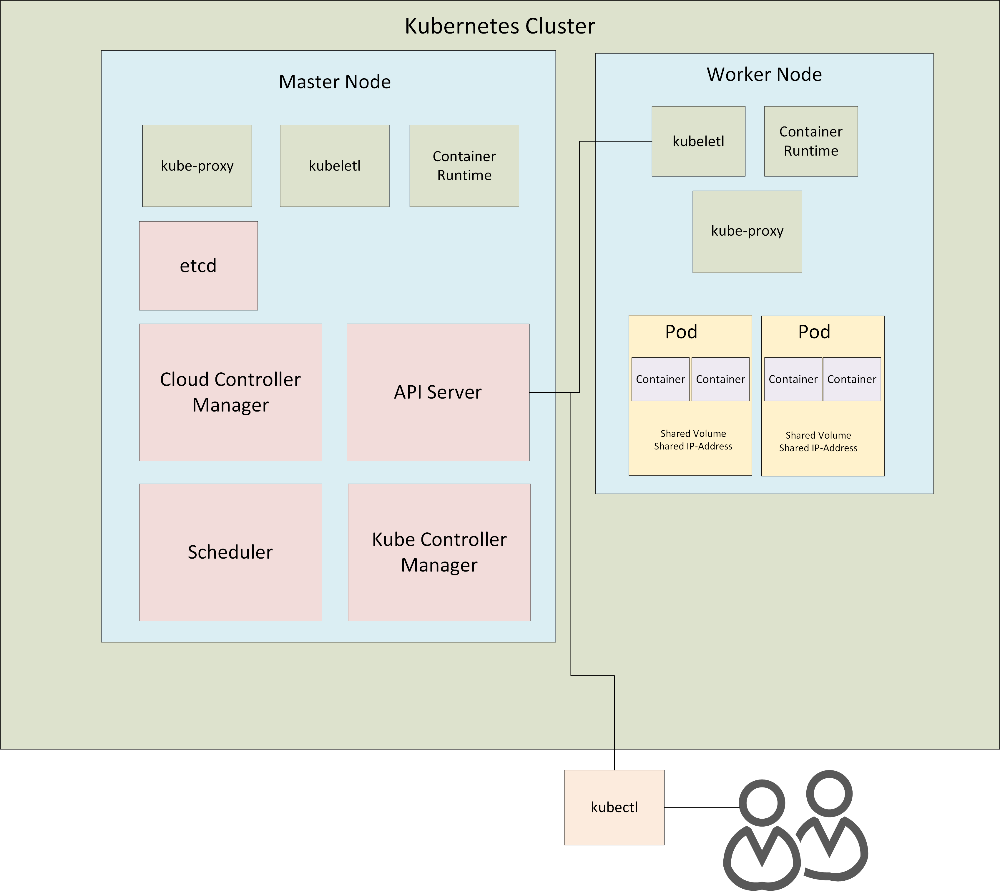

# Kubernetes

Kubernetes ist eine Open Source Technologie und Standard zur Bereitstellung containerisierter Applikationen.

-> Container Orchestration System.

Containers can be deployed on different servers (physical or virtual).

Key features:
- automatic deployment of containerized applications across different servers
- load distribution across multiple servers
- automatic scaling of the deployed applications
- monitoring and health check of the containers
- replacement of the failed containers

Supported container runtimes:
- Docker
- CRI-O
- containerd

-> container runtime must be running on each of the servers (nodes) running on the cluster.

## Architecture

## Terminologie

### POD

= Smallest possible unit.
- containers are build inside the pod
- shared volumes
- shared IP address
- one pod one server, splitting containers inside pod across servers not possible

-> mostly single container pods

### Kubernetes Clusters

- consists of Nodes (=servers)
- nodes consist of pods
- pods consist of containers

Clusters and Nodes have to be defined by developer.
Pods are automatically deployed to nodes.

### Nodes

Types of Nodes:
- Master Node (control plane) contains only system pods and manages
- Worker Nodes that contain the application pods

Services on each node:
- Container Runtime
- kubeletl (communication between API server and node)
- kube-proxy (network communication inside node and between nodes)

Service on master node:
- scheduler (planning distribution of load between different cluster)
- api-server (communication with nodes)
- clud-controller manager (cloud related issues)
- etcd (logs of whole cluster)
- kube-controller-manager (orchestrates whole cluster)

### kubectl:

Command line tool to manage clusters remotely over the API Server (REST Interface)

### namespaces:

Group different resources and configuration objects

## Deployment
Deployments allow automatic management of pods. See "2. deployments" for a tutorial on deployments.

## Connect Deployments over Network

## Other Container Runtimes